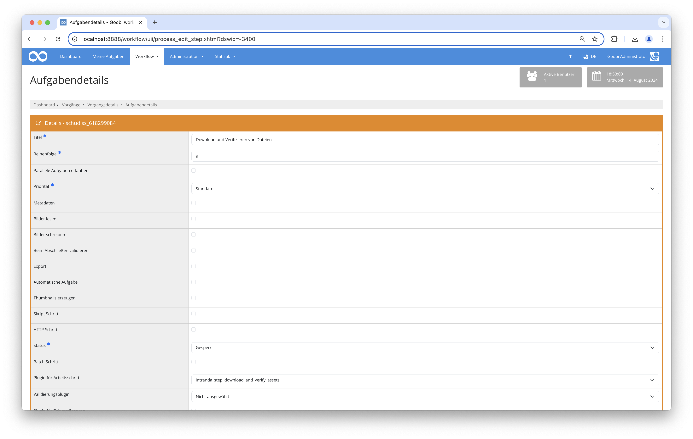

## Einführung
Dieses Plugin liest Datei-IDs und Hash-Werte aus konfigurierten Vorgangseigenschaften oder Metadaten, baut daraus eine Download-URL zusammen, lädt die Dateien herunter und vergleicht sie anschließend mit dem zugehörigen Hash-Wert. Um fehlerhafte Teildownloads zu vermeiden, wird jede Datei zunächst unter einem temporären Dateinamen gespeichert und erst nach erfolgreich verifiziertem Hash in den endgültigen Dateinamen umbenannt. Abschließend können mehrere Rückmeldungen gegeben werden, je nachdem ob der Status `success` oder `error` lautet. Diese Rückmeldungen können per REST zu einem anderen System geschickt oder einfach innerhalb des Journals geloggt werden.


## Installation
Zur Installation des Plugins muss die folgende Datei installiert werden:

```bash
/opt/digiverso/goobi/plugins/step/plugin_intranda_step_download_and_verify_assets-base.jar
```

Die Konfigurationsdatei befindet sich üblicherweise hier:

```bash
/opt/digiverso/goobi/config/plugin_intranda_step_download_and_verify_assets.xml
```



## Konfiguration
Der Inhalt dieser Konfigurationsdatei sieht beispielhaft wie folgt aus:

```xml
<config_plugin>
    <!--
        order of configuration is:
          1.) project name and step name matches
          2.) step name matches and project is *
          3.) project name matches and step name is *
          4.) project name and step name are *
    -->

    <config>
        <!-- which projects to use for (can be more then one, otherwise use *) -->
        <project>*</project>
        <step>*</step>

        <!-- Configure here how many times shall be maximally tried before reporting final results. OPTIONAL. DEFAULT 1. -->
        <maxTryTimes>3</maxTryTimes>

        <!-- Optional authentication header value sent with every download request. -->
        <authentication>Bearer 123456</authentication>

        <!-- HTTP method used to download files. Options: get (default) | post -->
        <downloadMethod>get</downloadMethod>

        <!-- If false (default), already existing files are skipped. Set to true to overwrite existing files. -->
        <overwriteFiles>false</overwriteFiles>

        <!-- URL template for the download. {FILEID} is replaced with the value from @fileId. Goobi variables are supported. -->
        <downloadUrl>https://example.com/thesis/{meta.ThesisId}/file/{FILEID}</downloadUrl>

        <!-- This tag accepts the following attributes:
              - @fileId: name of the property or metadata type that holds the file ID (replaces {FILEID} in the URL template).
                         The legacy alias @urlProperty is still accepted when @fileId is absent.
              - @hashProperty: name of the property or metadata type that holds the SHA-256 checksum of the file. OPTIONAL.
              - @folder: name of the target folder for the downloaded file. OPTIONAL. DEFAULT master.
              - @source: where to read @fileId and @hashProperty values from.
                         Options: property (default) | metadata
              - @metadataLevel: which DocStruct level to read from when source=metadata.
                         Options: topstruct (default) | firstchild
         -->

        <!-- Read file IDs and hashes from process properties (default): -->
        <fileNameProperty fileId="AttachmentIDSplitted" hashProperty="AttachmentHashSplitted" folder="master" />

        <!-- Read file IDs and hashes from process metadata (topstruct level): -->
        <fileNameProperty fileId="AttachmentID" hashProperty="AttachmentHash" folder="master"
                          source="metadata" metadataLevel="topstruct" />

        <!-- Read file IDs and hashes from process metadata (firstchild, e.g. for volumes): -->
        <fileNameProperty fileId="AttachmentID" hashProperty="AttachmentHash" folder="master"
                          source="metadata" metadataLevel="firstchild" />

        <!-- A response tag accepts four attributes:
              - @type: success | error. Determines by which cases this configured response shall be activated.
              - @method: OPTIONAL. If not configured or configured blankly, then the response will be performed via journal logs. Non-blank configuration options are: put | post | patch.
              - @url: URL to the target system expecting this response. MANDATORY if @method is not blank.
              - @message: Message that shall be logged into journal. ONLY needed when @method is blank.
              - - - - - - - - - - - - - - - - - - - - - - - - - - - - - - - - - - - - - - - - - - - - - - - - - - - - -
              One can also define a JSON string inside a pair of these tags, which will be used as JSON body to shoot a REST request.
         -->
        <!-- Usage of Goobi variables in @url as well as @message is allowed. -->
        <response type="success" method="put" url="URL_ZU_BACH/upload_successful/{meta.ThesisId}" />

        <!-- Log ERROR_MESSAGE into journal as a signal of errors -->
        <response type="error" message="ERROR_MESSAGE" />

        <!-- Example for REST calls with json body -->
        <!--
        <response type="success" method="put" url="CHANGE_ME">
        {
           "id": 0,
           "name": "string",
           "value": "string"
        }
        </response>
        -->

    </config>

</config_plugin>
```

Der Block `<config>` kann für verschiedene Projekte oder Arbeitsschritte wiederholt vorkommen, um innerhalb verschiedener Workflows unterschiedliche Aktionen durchführen zu können.

| Wert | Beschreibung |
| :--- | :--- |
| `project` | Dieser Parameter legt fest, für welches Projekt der aktuelle Block `<config>` gelten soll. Verwendet wird hierbei der Name des Projektes. Dieser Parameter kann mehrfach pro `<config>` Block vorkommen. |
| `step` | Dieser Parameter steuert, für welche Arbeitsschritte der Block `<config>` gelten soll. Verwendet wird hier der Name des Arbeitsschritts. Dieser Parameter kann mehrfach pro `<config>` Block vorkommen. |
| `maxTryTimes` | Dieser Wert legt fest, wie viele Versuche maximal erfolgen sollen, bevor Rückmeldungen gegeben werden müssen. Dieser Parameter ist optional und hat den Standardwert `1`. |
| `authentication` | Optionaler Authentifizierungs-Header, der bei jedem Download-Request mitgesendet wird (z. B. `Bearer 123456`). |
| `downloadMethod` | HTTP-Methode für den Datei-Download. Mögliche Werte: `get` (Standard) oder `post`. |
| `overwriteFiles` | Steuert das Verhalten bei bereits vorhandenen Zieldateien. Ist der Wert `false` (Standard), werden bestehende Dateien übersprungen. Bei `true` werden bestehende Dateien überschrieben. |
| `downloadUrl` | URL-Template für den Download. Der Platzhalter `{FILEID}` wird durch den Wert aus `@fileId` ersetzt. Goobi-Variablen (z. B. `{meta.ThesisId}`) werden ebenfalls unterstützt. |
| `fileNameProperty` | Dieser Parameter steuert den Teil für das Herunterladen und Verifizieren der Dateien. Er kann mehrfach vorkommen. `@fileId` definiert den Namen der Eigenschaft oder des Metadatentyps, der die Datei-ID enthält. Das veraltete Alias `@urlProperty` wird weiterhin akzeptiert, wenn `@fileId` fehlt. `@hashProperty` definiert den Namen der Eigenschaft oder des Metadatentyps mit dem SHA-256-Hashwert der Datei (optional). Das Attribut `@folder` ist optional und hat den Standardwert `master`. Mit `@source` wird festgelegt, woher die Werte gelesen werden: `property` (Standard, Vorgangseigenschaften) oder `metadata` (Metadaten). Bei `source="metadata"` bestimmt `@metadataLevel`, von welcher DocStruct-Ebene gelesen wird: `topstruct` (Standard) oder `firstchild`. Fehlt der firstchild, wird die `fileNameProperty` mit einer Warnung übersprungen. |
| `response` | Dieser optionale Parameter kann verwendet werden, um mehrere Rückmeldungen nach dem Downloaden und Verifizieren der Dateien zu geben. Er akzeptiert vier Attribute und einen JSON-Text für REST-Requests mit JSON-Body. Mehr Details und Beispiele sind innerhalb der Kommentare der beispielhaften Konfigurationsdatei ersichtlich. |
