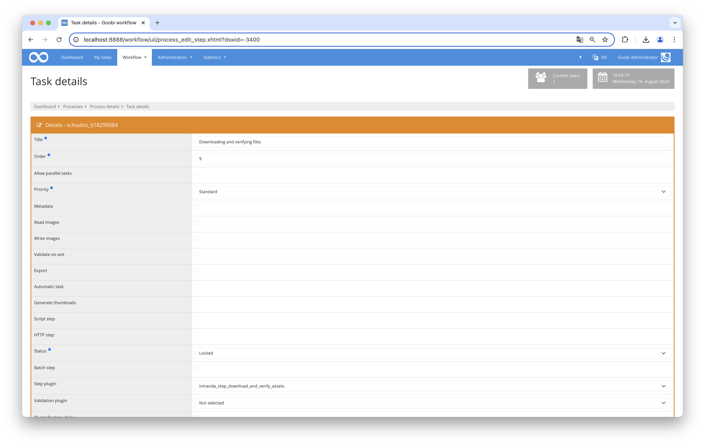

## Introduction
This plugin reads file IDs and hash values from configured process properties or metadata, constructs a download URL from them, downloads the files, and then compares them with the corresponding hash value. To prevent corrupt partial files, each file is first saved under a temporary name and only renamed to its final path after the hash has been successfully verified. Finally, several responses can be given depending on whether the status is `success` or `error`. These responses can be sent to another system via REST or simply logged within the journal.


## Installation
To install the plugin, the following file must be installed:

```bash
/opt/digiverso/goobi/plugins/step/plugin_intranda_step_download_and_verify_assets-base.jar
```

The configuration file is usually located here:

```bash
/opt/digiverso/goobi/config/plugin_intranda_step_download_and_verify_assets.xml
```



## Configuration
The content of this configuration file looks like the following example:

```xml
<config_plugin>
    <!--
        order of configuration is:
          1.) project name and step name matches
          2.) step name matches and project is *
          3.) project name matches and step name is *
          4.) project name and step name are *
    -->

    <config>
        <!-- which projects to use for (can be more then one, otherwise use *) -->
        <project>*</project>
        <step>*</step>

        <!-- Configure here how many times shall be maximally tried before reporting final results. OPTIONAL. DEFAULT 1. -->
        <maxTryTimes>3</maxTryTimes>

        <!-- Optional authentication header value sent with every download request. -->
        <authentication>Bearer 123456</authentication>

        <!-- HTTP method used to download files. Options: get (default) | post -->
        <downloadMethod>get</downloadMethod>

        <!-- If false (default), already existing files are skipped. Set to true to overwrite existing files. -->
        <overwriteFiles>false</overwriteFiles>

        <!-- URL template for the download. {FILEID} is replaced with the value from @fileId. Goobi variables are supported. -->
        <downloadUrl>https://example.com/thesis/{meta.ThesisId}/file/{FILEID}</downloadUrl>

        <!-- This tag accepts the following attributes:
              - @fileId: name of the property or metadata type that holds the file ID (replaces {FILEID} in the URL template).
                         The legacy alias @urlProperty is still accepted when @fileId is absent.
              - @hashProperty: name of the property or metadata type that holds the SHA-256 checksum of the file. OPTIONAL.
              - @folder: name of the target folder for the downloaded file. OPTIONAL. DEFAULT master.
              - @source: where to read @fileId and @hashProperty values from.
                         Options: property (default) | metadata
              - @metadataLevel: which DocStruct level to read from when source=metadata.
                         Options: topstruct (default) | firstchild
         -->

        <!-- Read file IDs and hashes from process properties (default): -->
        <fileNameProperty fileId="AttachmentIDSplitted" hashProperty="AttachmentHashSplitted" folder="master" />

        <!-- Read file IDs and hashes from process metadata (topstruct level): -->
        <fileNameProperty fileId="AttachmentID" hashProperty="AttachmentHash" folder="master"
                          source="metadata" metadataLevel="topstruct" />

        <!-- Read file IDs and hashes from process metadata (firstchild, e.g. for volumes): -->
        <fileNameProperty fileId="AttachmentID" hashProperty="AttachmentHash" folder="master"
                          source="metadata" metadataLevel="firstchild" />

        <!-- A response tag accepts four attributes:
              - @type: success | error. Determines by which cases this configured response shall be activated.
              - @method: OPTIONAL. If not configured or configured blankly, then the response will be performed via journal logs. Non-blank configuration options are: put | post | patch.
              - @url: URL to the target system expecting this response. MANDATORY if @method is not blank.
              - @message: Message that shall be logged into journal. ONLY needed when @method is blank.
              - - - - - - - - - - - - - - - - - - - - - - - - - - - - - - - - - - - - - - - - - - - - - - - - - - - - -
              One can also define a JSON string inside a pair of these tags, which will be used as JSON body to shoot a REST request.
         -->
        <!-- Usage of Goobi variables in @url as well as @message is allowed. -->
        <response type="success" method="put" url="URL_TO_BACH/upload_successful/{meta.ThesisId}" />

        <!-- Log ERROR_MESSAGE into journal as a signal of errors -->
        <response type="error" message="ERROR_MESSAGE" />

        <!-- Example for REST calls with json body -->
        <!--
        <response type="success" method="put" url="CHANGE_ME">
        {
           "id": 0,
           "name": "string",
           "value": "string"
        }
        </response>
        -->

    </config>

</config_plugin>
```

The `<config>` block can occur repeatedly for different projects or work steps in order to be able to perform different actions within different workflows.

| Value | Description |
| :--- | :--- |
| `project` | This parameter defines which project the current block `<config>` should apply to. The name of the project is used here. This parameter can occur several times per `<config>` block. |
| `step` | This parameter controls which work steps the `<config>` block should apply to. The name of the work step is used here. This parameter can occur several times per `<config>` block. |
| `maxTryTimes` | This value defines the maximum number of attempts to be made before feedback must be given. This parameter is optional and has the default value `1`. |
| `authentication` | Optional authentication header value sent with every download request (e.g. `Bearer 123456`). |
| `downloadMethod` | HTTP method used to download files. Accepted values: `get` (default) or `post`. |
| `overwriteFiles` | Controls the behaviour when a target file already exists. When set to `false` (default), existing files are skipped. When set to `true`, existing files are overwritten. |
| `downloadUrl` | URL template for the download. The placeholder `{FILEID}` is replaced with the value from `@fileId`. Goobi variables (e.g. `{meta.ThesisId}`) are also supported. |
| `fileNameProperty` | This parameter controls the download and verification of files. It can occur multiple times. `@fileId` defines the name of the property or metadata type that holds the file ID. The legacy alias `@urlProperty` is still accepted when `@fileId` is absent. `@hashProperty` defines the name of the property or metadata type that holds the SHA-256 checksum (optional). The attribute `@folder` is optional and defaults to `master`. `@source` determines where the values are read from: `property` (default, process properties) or `metadata` (process metadata). When `source="metadata"`, `@metadataLevel` specifies which DocStruct level to read from: `topstruct` (default) or `firstchild`. If the firstchild is missing, the `fileNameProperty` entry is skipped with a warning. |
| `response` | This optional parameter can be used to provide multiple responses after downloading and verifying the files. It accepts four attributes and a JSON text for REST requests with a JSON body. More details and examples can be found in the comments of the sample configuration file. |
